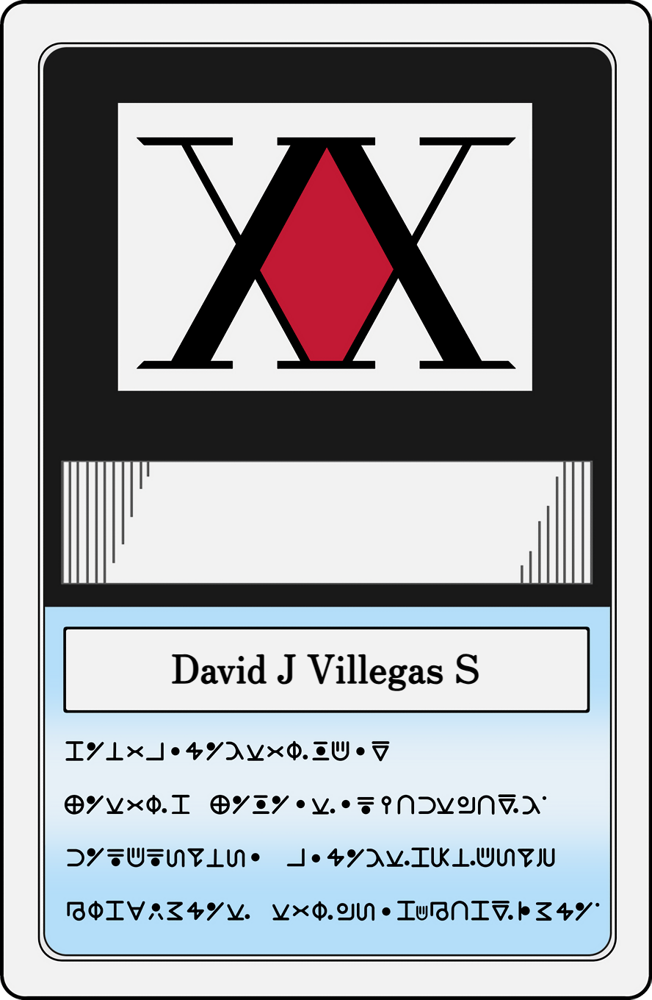

<!-- ════════════════════════════════════════════════════════════════
     DavidSnake3 — GitHub Profile README
     Hunter × Hunter themed · Pixel/Retro aesthetic
     Mirrors README Preview.html exactly
     ════════════════════════════════════════════════════════════════ -->

<!-- ────── HERO: BANNER + NAME ────── -->

### DAVID J. VILLEGAS S.

**Full-Stack Engineer**  ·  Costa Rica 🇨🇷

 

<!-- ────── CONTACT BUTTONS ────── -->

 

---

## HUNTER LICENSE

<table>
<tr>
<td width="270" valign="top" align="center">

<!-- ░░ HXH LICENSE CARD (single image) ░░ -->

</td>
<td valign="top">

#### David Josue Villegas Salas — SNAKE

Hello, I'm David, a Full-Stack Engineer with over **three years** experience focused on projecting my moral and ethical values in every project **to provide high-quality tools and meet your business expectations.**

Throughout my academic and professional career, I have developed numerous projects using both traditional and cutting-edge technologies. Through my projects, I have contributed to process optimization, which has **increased productivity by up to 40% through workflow automation.**

 

  
  &nbsp;&nbsp;&nbsp;&nbsp;&nbsp;&nbsp;&nbsp;&nbsp;
  
   

</td>
</tr>
</table>

---

## HUNTER STATS

<table width="100%" cellspacing="0" cellpadding="0">
<tr>
<td width="50%" align="center" valign="top">

</td>
<td width="50%" align="center" valign="top">

</td>
</tr>
</table>

---

## NEN ABILITIES — TECH STACK

#### ▸ Languages

#### ▸ Frameworks & Libraries

#### ▸ Microsoft Power Platform

#### ▸ Cloud & DevOps

#### ▸ Data & Analytics

#### ▸ Testing & Methodologies

---

▸ <b>DavidSnake3</b>  ·  Costa Rica 🇨🇷

